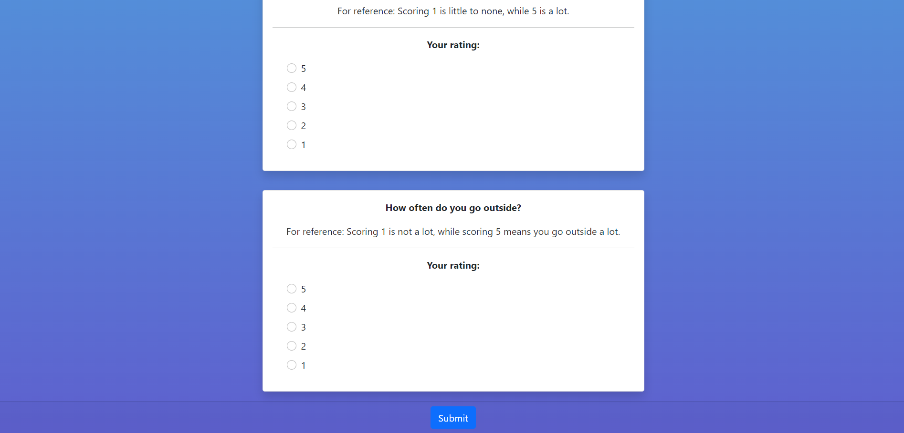

# STRESS FREE ME

## Description

Stress-Free-Me is an innovative web application designed to guide users through a series of targeted inquiries, facilitating a comprehensive assessment of individual stress levels. Through intuitive charts, users can effortlessly visualize their recent survey results alongside their historical stress data, enabling a nuanced understanding of their stress patterns over time.

## User Story

```
If you have experienced periods of academic pressure and are interested in discerning the key factors contributing to your stress levels, we invite you to participate in this brief survey. Your responses will help you gain insights into the primary influencers of your current state of stress.
```

## Table of Contents

- [User Story](#user-story)
- [Usage](#Usage)
- [Credits/Contributors](#Credits/Contributors)
- [Technologies Used](#technologies-used)
- [References](#references)
- [Links](#links)
- [License](#license)


## Usage





## Credits/Contributors

- Andrew Bakhaya - <a href="https://github.com/AndyBakhaya">Github</a>
- Matthew Casey - <a href="https://github.com/MAT-2">Github</a>
- Diego Cornejo - <a href="https://github.com/CornejoD">Github</a>
- Kai Gurung-Doll - <a href="https://github.com/KaiDoll">Github</a>
- Robert Mancuso - <a href="https://github.com/bmancuso3">Github</a>

## Technologies Used

- JavaScript
- Node.js
- Chart.js
- HTML
- Bootstrap CSS
- Handlebars

## References

- UT Austin Bootcamp Curriculum: Module 14 (MVC)
- https://mdbootstrap.com/docs/standard/components/cards/
- https://mdbootstrap.com/docs/standard/components/cards/
- For question source: https://www.kaggle.com/datasets/samyakb/student-stress-factors
- https://developer.mozilla.org/en-US/docs/Web/API/Event/preventDefault
- Logo Image: https://www.google.com/url?sa=i&url=https%3A%2F%2Fwww.flaticon.com%2Ffree-icon%2Fstress_5361723&psig=AOvVaw1vq4JICD4NNPyPqKmijOOP&ust=1699462380260000&source=images&cd=vfe&opi=89978449&ved=0CBQQjhxqFwoTCOi45-2ssoIDFQAAAAAdAAAAABAE
- https://getbootstrap.com/docs/5.0/utilities/colors/
- https://getbootstrap.com/docs/5.0/utilities/borders/
- https://www.w3schools.com/css/css_background.asp
- https://bootcamp.uxdesign.cc/use-css-gradients-for-background-gradient-images-dc98c2b7848a
- https://www.geeksforgeeks.org/how-to-place-two-bootstrap-cards-next-to-each-other/
- Chart.JS v.4.4.0: https://www.chartjs.org/docs/latest/getting-started/installation.html
- DOTENV v.8.2.0: https://www.npmjs.com/package/dotenv
- Express.JS v.4.17.1: https://expressjs.com/en/starter/installing.html
- Handlebars.JS v.5.2.0: https://handlebarsjs.com/installation/
- MYSQL2 v.2.2.5: https://www.npmjs.com/package/mysql2
- Sequelize v.6.3.5: https://sequelize.org/docs/v6/getting-started/

## Links

### <a href="https://github.com/bmancuso3/stress-free-me">GitHub Repository</a>

### <a href="https://bmancuso3.github.io/stress-free-me">Live Site</a>


## License


Copyright 2023 - Stress Free Me

Permission is hereby granted, free of charge, to any person obtaining a copy of this software and associated documentation files (the “Software”), to deal in the Software without restriction, including without limitation the rights to use, copy, modify, merge, publish, distribute, sublicense, and/or sell copies of the Software, and to permit persons to whom the Software is furnished to do so, subject to the following conditions:

The above copyright notice and this permission notice shall be included in all copies or substantial portions of the Software.

THE SOFTWARE IS PROVIDED “AS IS”, WITHOUT WARRANTY OF ANY KIND, EXPRESS OR IMPLIED, INCLUDING BUT NOT LIMITED TO THE WARRANTIES OF MERCHANTABILITY, FITNESS FOR A PARTICULAR PURPOSE AND NONINFRINGEMENT. IN NO EVENT SHALL THE AUTHORS OR COPYRIGHT HOLDERS BE LIABLE FOR ANY CLAIM, DAMAGES OR OTHER LIABILITY, WHETHER IN AN ACTION OF CONTRACT, TORT OR OTHERWISE, ARISING FROM, OUT OF OR IN CONNECTION WITH THE SOFTWARE OR THE USE OR OTHER DEALINGS IN THE SOFTWARE.
